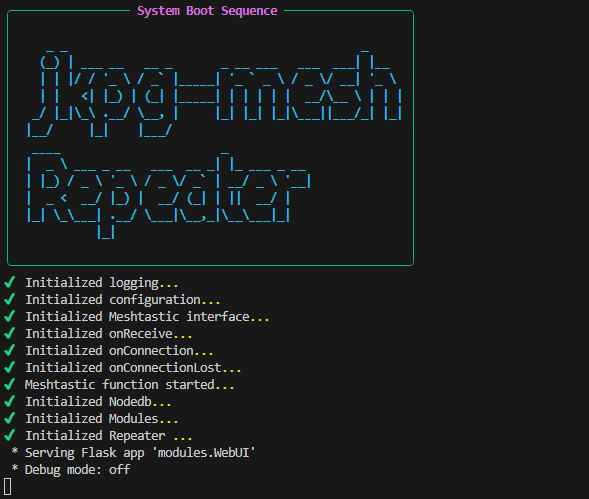
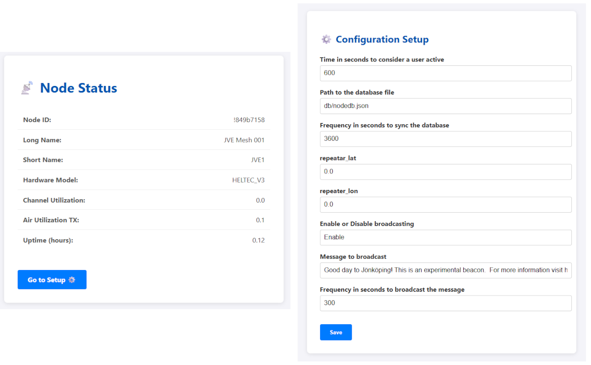

# Jönköping Mesh Beacon - A Meshtastic Utility

License: MIT  
Repository: https://github.com/jkpg-mesh/mesh-repeater

## Description
This application acts as a **beacon node** for the Meshtastic mesh network in Jönköping.  
It is designed to run on a PC or Raspberry Pi connected to a Meshtastic device via USB.

Unlike a traditional repeater, this utility periodically broadcasts its presence, synchronizes node information, and provides a web interface for monitoring network activity.  
It helps the community by serving as a stable, always-on node that announces itself and tracks active users.



### Key Features
- **Beacon Functionality:** Periodically broadcasts a customizable message to the mesh.
- **Node Database:** Stores extended node info and recent activity beyond the device’s built-in limits.
- **Web UI:** Optional web interface for viewing active nodes and network status.
- **Command Handling:** Responds to basic commands (e.g., `/info`, `/users`, `/signal`, `/distance`) sent via Meshtastic text messages.
- **Extensible:** Easily add new modules or features.




## Requirements
- meshtastic
- tinydb
- rich
- pubsub
- flask
- geopy
- adafruit-circuitpython-ahtx0
- adafruit-circuitpython-bmp280
- adafruit-blinka  # Required for sensor support on Raspberry Pi/PC

## Usage
1. Connect your Meshtastic device via USB.
2. Install dependencies:
   ```
   pip install -r requirements.txt
   ```
   
   If you are running on a Raspberry Pi or similar, ensure I2C is enabled and install the following for sensor support:
   ```
   pip install adafruit-blinka adafruit-circuitpython-ahtx0 adafruit-circuitpython-bmp280
   ```
3. Run the application:
   ```
   python main.py
   ```
4. Access the web interface (if enabled) for node status and activity.


## MET Data (Weather Sensor Support)

This project supports reading environmental data (temperature, humidity, and pressure) from AHT20 and BMP280 sensors via I2C. The data is displayed in the Web UI and can be included in broadcast messages.

**Required Hardware:**
- AHT20 (temperature/humidity sensor)
- BMP280 (pressure/temperature sensor)
- Raspberry Pi or compatible device with I2C enabled

**Setup:**
1. Connect the sensors to your device's I2C pins.
2. Enable I2C on your Raspberry Pi (use `raspi-config` or similar tool).
3. Ensure the following Python packages are installed:
   - `adafruit-blinka`
   - `adafruit-circuitpython-ahtx0`
   - `adafruit-circuitpython-bmp280`
4. Configure MET options in `config/config.json` (e.g., enable/disable, interval, altitude).

**Configuration Example:**
```
"met_on": "Enabled",
"met_interval": "30",
"altitude": "120"
```

---
## Notes
- This utility is intended as a **beacon** or “anchor” node, not a message repeater.
- Node activity and user presence are tracked in a local database for improved visibility.
- Configuration options are available in `config/config.json`.

---

For more details, see the [repository](https://github.com/jkpg-mesh/mesh-repeater).